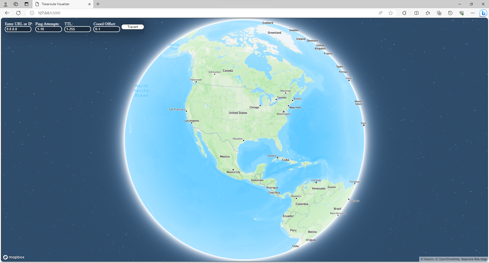
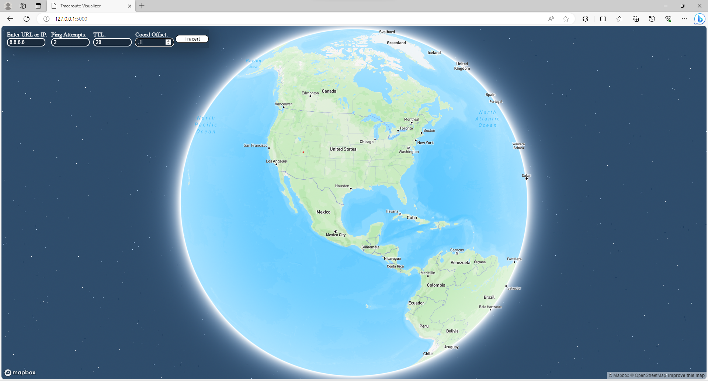
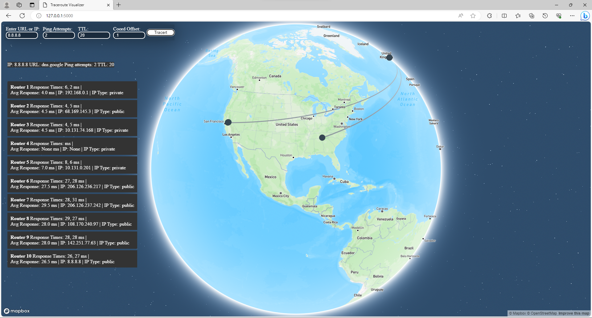
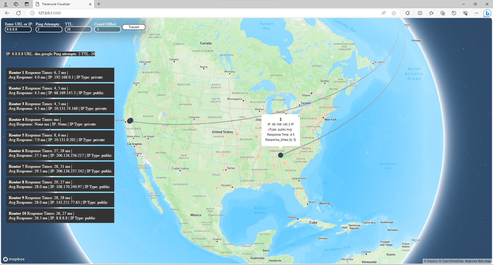
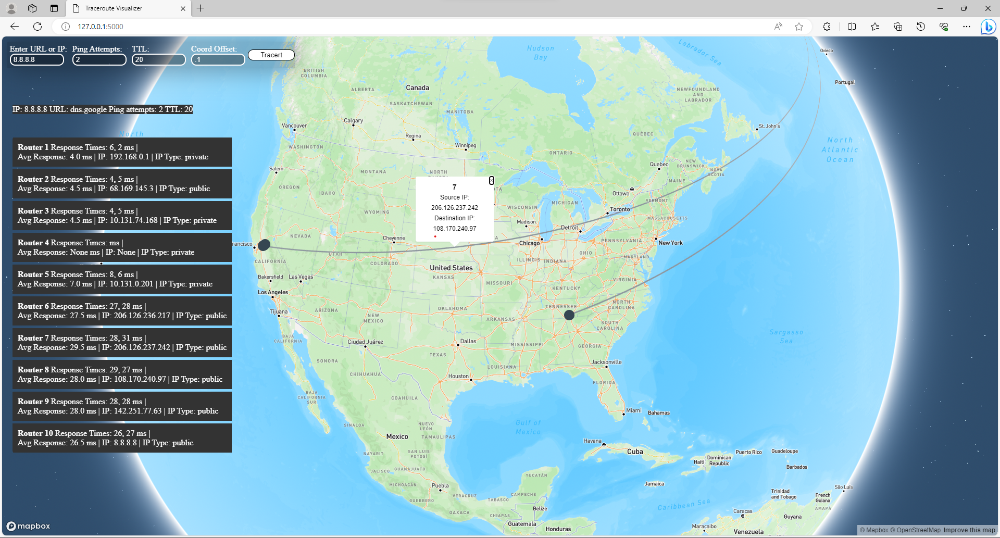

# Traceroute Visualizer

Traceroute Visualizer is a tool that helps visualize traceroute results on a map, making it easier to understand network paths.

## Installation

Follow these steps to set up Traceroute Visualizer on your local machine:

1. Clone the Git repository to your local machine: https://github.com/colemorrison/Traceroute-Visualizer2.git

2. Navigate to the project directory and create a Python Virtual Environment:
   cd traceroute-visualizer
   python -m venv venv

3. Activate the virtual environment:

- For Windows:
  ```
  venv\Scripts\activate
  ```
- For macOS/Linux:
  ```
  source venv/bin/activate
  ```

4. Install the required packages: pip install -r requirements.txt

5. Start the program by running: python main.py

6. After running the above command, a link to access the application will be displayed in the terminal. You can also access the application by clicking the link provided or by typing the following URL into your web browser: http://127.0.0.1:5000

Note: Ensure that you have an active internet connection and use Ethernet for the traceroute function to work properly.

## User Interface (UI):

- **Enter URL or IP:** Enter the target URL or IP address you want to trace.
- **Ping Attempts:** Set the number of times the traceroute function will ping the routers.
- **TTL (Time to Live):** Define the maximum number of hops the final packet will make. This prevents endless loops.
- **Coord Offset:** Adjust the map marker offset to avoid overlapping for routers with the same location.
- **Traceroute:** Click this button to initiate the traceroute function and visualize the results on the map.

## Image Section

Here are some images illustrating the functionality of Traceroute Visualizer:


_This is the start screen of the application._


_The image shows the application with the input fields filled._


_This image displays the traceroute function in progress._


_When clicking on a router, a pop-up displays router information and delays._


_This image demonstrates clicking on a link line to view information about the routers involved._

## Technology Stack

The Traceroute Visualizer is built using the following technologies and libraries:

- **Languages:** Python, HTML, CSS, JavaScript
- **Libraries:** Flask 3.0.0, jyserver 0.0.5, scapy 2.5.0, ip2geotools 0.1.6
- **Applied Skills** SOLID Principles
- **API** Mapbox ([Learn More](https://docs.mapbox.com/api/overview/))

## Contact Information

| Contact Method | Details                                                                  |
| -------------- | ------------------------------------------------------------------------ |
| Email          | [Colemorrison321@icloud.com](mailto:Colemorrison321@icloud.com)          |
| Phone          | [904-476-1448](tel:904-476-1448)                                         |
| GitHub         | [GitHub Profile](https://github.com/colemorrison)                        |
| GitLab         | [GitLab Profile](https://gitlab.com/colemorrison)                        |
| LinkedIn       | [LinkedIn Profile](https://www.linkedin.com/in/cole-morrison-b7645a27a/) |
